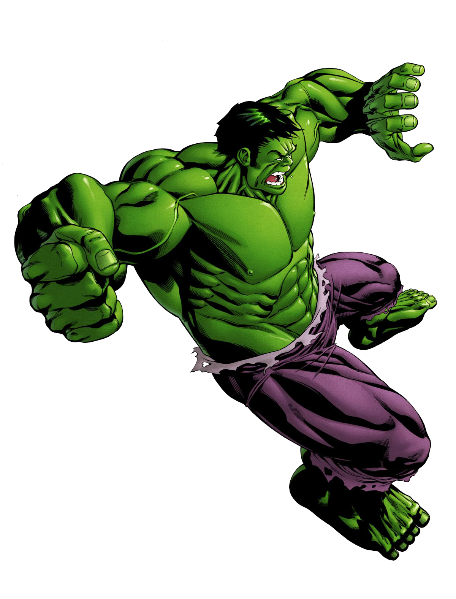
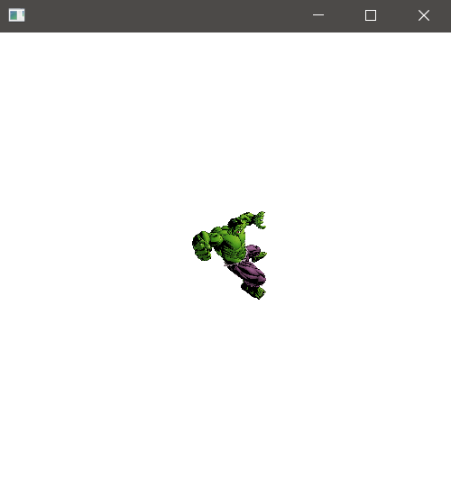
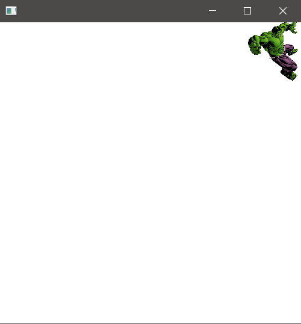

## Description

### hello-view.fxml in SceneBuilder

- Controller
  - com.sunday.animations.HelloController

- Containers
  - AnchorPane (400x400)

- Controls
  - ImageView
    - Image: select the image.
    - The image hulk.png is in: resource>images

### HelloController.java - Translation

~~~
public class HelloController implements Initializable {
    @FXML
    private ImageView imgvHulk;

    @Override
    public void initialize(URL url, ResourceBundle resourceBundle) {
        // TRANSLATION
        TranslateTransition translate = new TranslateTransition();
        // add the image to translate
        translate.setNode(imgvHulk);
        // with the previous step the image can be translated in the X,Y,Z axis
        // X and Y in combination would be diagonal
        // translation in X axis
        translate.setByX(170); // +170: right / -170: left
        // translation in Y axis
        translate.setByY(-170); // +170: down / -170: up
        // time for the translation (it will move and stop)
        translate.setDuration(Duration.millis(1000)); // 1 second
        // cycle: repetition
        translate.setCycleCount(TranslateTransition.INDEFINITE); // infinite cycles
        // translate.setCycleCount(2); // default: 1 // to make it move twice
        // to have a bounce effect
        translate.setAutoReverse(true); // default: false
        translate.play();
    }
}
~~~

**Run the app**

***Translation cycle 1***

***Translation cycle 2***

### HelloController.java - Rotation

~~~
public class HelloController implements Initializable {
    @FXML
    private ImageView imgvHulk;

    @Override
    public void initialize(URL url, ResourceBundle resourceBundle) {
        // ROTATION
        RotateTransition rotate = new RotateTransition();
        rotate.setNode(imgvHulk);
        rotate.setDuration(Duration.millis(2000)); // 2 second
        rotate.setCycleCount(TranslateTransition.INDEFINITE); // infinite cycles
        // angle of rotation
        rotate.setByAngle(360);
        // it starts to slow-down when it's finishing
        // ..to avoid that:
        rotate.setInterpolator(Interpolator.LINEAR);
        // By default it rotates on Z-axis
        rotate.setAxis(Rotate.X_AXIS);
        rotate.play();
    }
}
~~~

### HelloController.java - Fading

~~~
public class HelloController implements Initializable {
    @FXML
    private ImageView imgvHulk;

    @Override
    public void initialize(URL url, ResourceBundle resourceBundle) {
        // FADE
        FadeTransition fade = new FadeTransition();
        fade.setNode(imgvHulk);
        fade.setDuration(Duration.millis(2000)); // 2 second
        fade.setCycleCount(TranslateTransition.INDEFINITE); // infinite cycles
        fade.setInterpolator(Interpolator.LINEAR);
        // fading out (visible to less visible)
        fade.setFromValue(1); // initial, 1 is visible at 100%
        fade.setToValue(0.2); // ending, it can be '0'
        fade.play();
    }
}
~~~

### HelloController.java - Scaling

~~~
public class HelloController implements Initializable {
    @FXML
    private ImageView imgvHulk;

    @Override
    public void initialize(URL url, ResourceBundle resourceBundle) {
        // SCALE
        ScaleTransition scale = new ScaleTransition();
        scale.setNode(imgvHulk);
        scale.setDuration(Duration.millis(2000)); // 2 second
        scale.setCycleCount(TranslateTransition.INDEFINITE); // infinite cycles
        scale.setInterpolator(Interpolator.LINEAR);
        // to stretch image in X-axis and Y-axis
        scale.setByX(2.0); // the image will stretch twice as it was before
        scale.setByY(2.0); // the image will stretch twice as it was before
        scale.play();
    }
}
~~~
