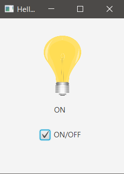

## APPLICATION

It turns on/off a lightbulb when a check-box is clicked. It also shows a message ON or OFF.

### hello-view.fxml in SceneBuilder

- Containers
  - AnchorPane (200x250)  

- Controls
  - CheckBox
    - Text: ON/OFF / fx:id: chbOnOff / onAction: change
  - Label
    - Text: OFF / fx:id: lbBulb
  - ImageView
    - fx:id: imvBulb / Image: bulb-off.png (initial image)

- Controller:
  - com.sunday.checkbox.HelloController

### helloController.java - Test CheckBox

Execute: It initiates with the check-box unselected, if it is selected, 'ON' will be printed in the Console. If next it is unselected, 'OFF' will be printed.

~~~
public class HelloController {

    @FXML
    private CheckBox chbOnOff;

    public void change(ActionEvent event) {
        if(chbOnOff.isSelected()) {
            System.out.println("ON");
        }else{
            System.out.println("OFF");
        }
    }
}
~~~

### HelloController.java - With Label and ImageView

~~~
public class HelloController {

    @FXML
    private CheckBox chbOnOff;
    @FXML
    private Label lbBulb;
    @FXML
    private ImageView imvBulb;

    Image bulb_on = new Image(getClass().getResourceAsStream("/images/bulb-on.png"));
    Image bulb_off = new Image(getClass().getResourceAsStream("/images/bulb-off.png"));

    public void change(ActionEvent event) {
        if(chbOnOff.isSelected()) {
            lbBulb.setText("ON");
            imvBulb.setImage(bulb_on);
        }else{
            lbBulb.setText("OFF");
            imvBulb.setImage(bulb_off);
        }
    }
}
~~~

**Al ejecutar**

***Bulb OFF***

***Bulb ON***

