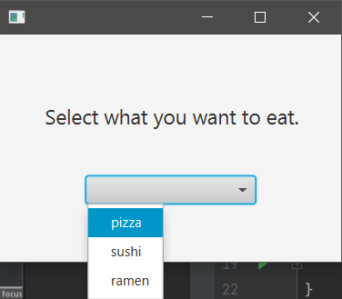
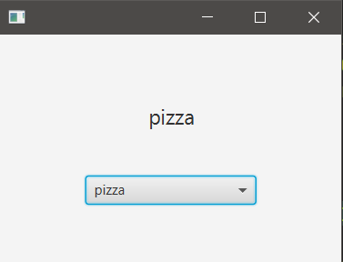

## Description

ChoiceBox control is like the combo-box.  
One option of a ChoiceBox will be selected and it will change the text of a Label.

### hello-view.fxml in SceneBuilder

- Containers
  - AnchorPane (300x200)

 
- Controls
  - ChoiceBox
    - fx:id: chobFood
  - Label
    - Stretch the borders of the label.
    - Text: Select what you want to eat.
    - Font size: 18px
    - Allignment: CENTER
    - fx:id: lbFood

- Controller
  - com.sunday.choicebox.HelloController
  
The ChoiceBox can't be populated with data using SceneBuilder
It also doesn't have an 'onAction' option.

### HelloController.java

If there is a warning on the ChoiceBox saying it's a raw type, a generic String can be used.  
The 'Initializable' interface with its method 'initialize()' is used to initialize a node after the root has been created.

~~~
public class HelloController implements Initializable {
    @FXML
    private Label lbFood;
    @FXML
    private ChoiceBox<String> chobFood;

    // Data to populate the ChoiceBox
    private String[] food = {"pizza", "sushi", "ramen"};

    @Override
    public void initialize(URL url, ResourceBundle resourceBundle) {
        chobFood.getItems().addAll(food);
        chobFood.setOnAction(event -> getFood(event)); // (this::getFood)
    }

    public void getFood(ActionEvent event) {
        String myFood = chobFood.getValue();
        lbFood.setText(myFood);
    }
}
~~~

**On execution**

***Initial view***

***Food selected***

A