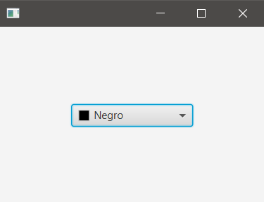
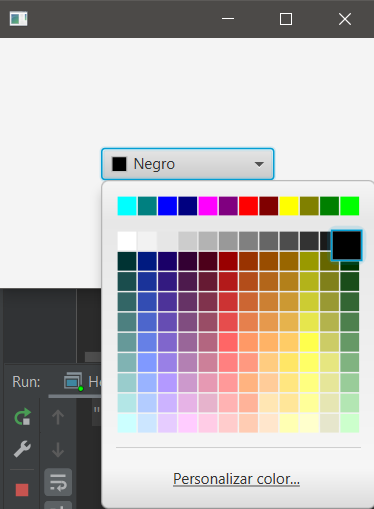
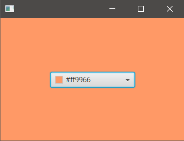

## Description
A ColorPicker is used to select the background-color of an AnchorPane.

### hello-view.fxml in SceneBuilder

- Containers
  - AnchorPane (300x200): fx:id: ancPane

- Controls
  - ColorPicker
    - Value: Black. By default it's White
    - fx:id: cpikColor
    - onAction: changeColor (when a color is selected)

- Controller
  - com.sunday.colorpicker.HelloController

### HelloController.java

~~~
public class HelloController {
    @FXML
    private AnchorPane ancPane;
    @FXML
    private ColorPicker cpikColor;

    public void changeColor(ActionEvent event) {
        Color color = cpikColor.getValue();
        // BackgroundFill(arg1,arg2,arg3) .. on the video it's said that arg2 y arg3
        // .. can be: CornerRadii.EMPTY and Insets.EMPTY; but it's assigned to null for simplicity
        ancPane.setBackground(new Background(new BackgroundFill(color, null, null)));
    }
}
~~~

**On Execution**

***Initial view***

***ColorPicker***

***Color selected***

a