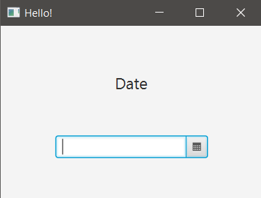
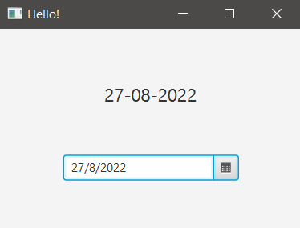

## START

When a date is selected on DatePicker, it will be shown in a label.

### hello-view.fxml in SceneBuilder

- Containers
  - AnchorPane (300x200)

- Controls
  - DatePicker
    - Prompt text: Enter a date / fx:id: dpikDate / onAction: getDate
  - Label
    - Text: Date / Font size: 18px / Allignment: CENTER (stretch the label borders) / fx:id: lbDate

- Controller
  - com.sunday.datepicker.HelloController

### HelloController.java - Testing the DatePicker

When a date is selected it will be printed in the Console.

~~~
public class HelloController {
    @FXML
    private DatePicker dpikDate;
    @FXML
    private Label lbDate;

    public void getDate(ActionEvent event) {
        LocalDate date = dpikDate.getValue();
        System.out.println(date.toString());
    }
}
~~~

### HelloController.java - Final version

~~~
public class HelloController {
    @FXML
    private DatePicker dpikDate;
    @FXML
    private Label lbDate;

    public void getDate(ActionEvent event) {
        LocalDate date = dpikDate.getValue();
        // Default format: MM-dd-yyyy
        // Changing the output format for date
        String myFormattedDate = date.format(DateTimeFormatter.ofPattern("dd-MM-yyyy"));
        lbDate.setText(myFormattedDate);
    }
}
~~~

**On execute**

***Initial view***

***Date selected***

