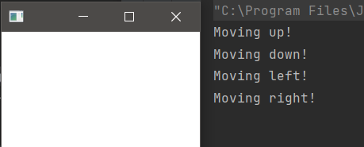

## Description

This is one way we can detect key-events: add a lambda of EventHandler to our Scene with setOnKeyPressed() method in the start() method.

### hello-view in SceneBuilder
- Set the Controller.

### HelloController.java

~~~
public class HelloController {
    public void moveUp() {
        System.out.println("Moving up!");
    }
    public void moveDown() {
        System.out.println("Moving down!");
    }
    public void moveLeft() {
        System.out.println("Moving left!");
    }
    public void moveRight() {
        System.out.println("Moving right!");
    }
}
~~~

### HelloApplication.java

To handle events, the `Functional Interface: EventHandler.java` is used.

~~~
@FunctionalInterface
public interface EventHandler<T extends Event> extends EventListener {
    void handle(T var1);
}
~~~

- That means, Lambda can be used.
- There are tree options: setOnKeyPressed(), setOnKeyReleased(), setOnKeyTyped  
- Basically said, "Key typed" events are input events while "Key pressed" and "Key released" events are keyboard events.
    
- Run -> if 'A' is pressed, it'll display on the Console: A UNDEFINED
- Run -> if left-arrow is pressed, it'll display on the Console: LEFT

~~~
public class HelloApplication extends Application {
    @Override
    public void start(Stage stage) throws IOException {
        FXMLLoader loader = new FXMLLoader(HelloApplication.class.getResource("hello-view.fxml"));
        Parent root = loader.load();

        // To have access to any member of our controller
        HelloController controller = loader.getController();
        Scene scene = new Scene(root);

        // handling key-press
        /*
        // Using anonymous class as an instance of the functional interface
        // When the scene detects a KeyEvent it will call the handle() method
            scene.setOnKeyPressed(new EventHandler<KeyEvent>() {
                @Override
                public void handle(KeyEvent keyEvent) {
                }
            });
        */
        // Using Lambda
        scene.setOnKeyPressed( event -> {
            // test to verify it's working: Press the arrows
            System.out.println(event.getCode());
        });

        stage.setScene(scene);
        stage.show();
    }

    public static void main(String[] args) {
        launch();
    }
}
~~~

### HelloApplication.java

- So, the handle() method can be used to detect the key that was pressed.  
- If left-arrow is pressed, it'll display on the Console: LEFT, the same with: UP, DOWN, RIGHT
- According to `HelloController.java` we only care about the arrow keys.

~~~
    scene.setOnKeyPressed( event -> {
        switch (event.getCode()) {
            case UP: controller.moveUp(); break;
            case DOWN: controller.moveDown(); break;
            case LEFT: controller.moveLeft(); break;
            case RIGHT: controller.moveRight(); break;
            default: break;
        }
    });
~~~

- When 'A' is pressed, it'll display on the Console: A UNDEFINED
- But in the switch the 'A' can be used without problems, the UNDEFINED won't affect.
- This is also possible.

~~~
    scene.setOnKeyPressed( event -> {
        switch (event.getCode()) {
            case W: controller.moveUp(); break;
            case S: controller.moveDown(); break;
            case A: controller.moveLeft(); break;
            case D: controller.moveRight(); break;
            default: break;
        }
    });
~~~

