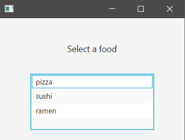
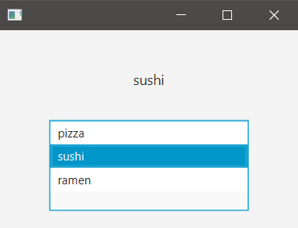

## Description

ListView is a list of items from which a user may interact with.

### hello-view.fxml in SceneBuilder

- Containers
  - AnchorPane (300x200)

- Controls
  - ListView
    - Fixed cell size: -1 (default) (the cell is as large as it's supposed to be)
    - fx:id: livFood
    - It doesn't have onAction, we'll need a listener
  - Label
    - Text: Select a food 
    - Font size: 14px 
    - Stretch the label until the anchor-pane border.
    - Alignment: CENTER
    - fx:id: lbFood

- Controller
  - com.sunday.listview.HelloController

### HelloController.java

~~~
public class HelloController implements Initializable {
    @FXML
    private ListView<String> livFood;
    @FXML
    private Label lbFood;

    private String[] foods = {"pizza", "sushi", "ramen"};
    private String currentFood;

    @Override
    public void initialize(URL url, ResourceBundle resourceBundle) {
        // add array-items to the list-view
        // on execution: the ListView displays the items
        livFood.getItems().addAll(foods);
        // on change the selection, the item will be displayed on the label
        livFood.getSelectionModel().selectedItemProperty().addListener( (var1,var2,var3) -> {
            // the selected item is stored
            currentFood = livFood.getSelectionModel().getSelectedItem();
            lbFood.setText(currentFood);
        });
    }
}
~~~

**Run the app**

***Initial view***

***Item selected***

