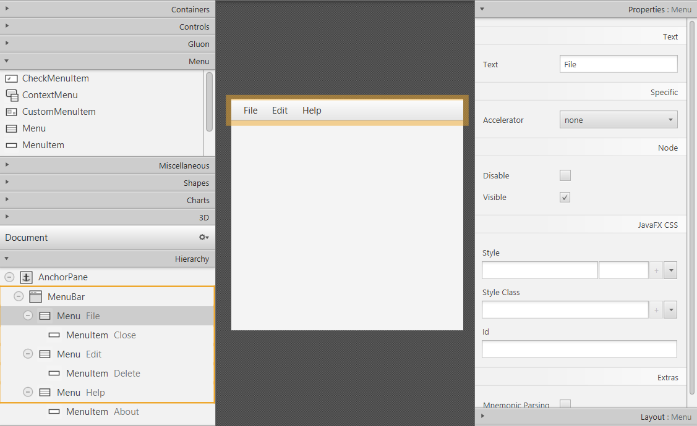
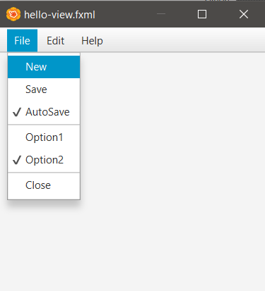
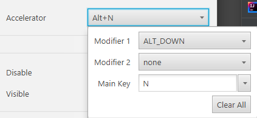
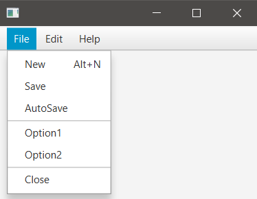

## Description

### hello-view.fxml in SceneBuilder

- Controller
  - com.sunday.menubar.HelloController

- Containers
  - AnchorPane (300x300)

- Controls
  - MenuBar
    - Expand it horizontally.

**Left panel: Hierarchy**
- Here menus can be managed.
- If a menu (tab) needs to be added, from Menu (left panel) can be drag and drop in Hierarchy (left panel).  
- In Hierarchy, by right-clicking Menu's can be managed.  
- It is also possible to change Properties (right panel).

**Left panel: Menu**
- Menu and MenuItem.
- SeparatorMenuItem .. separator line.
- CheckMenuItem .. menu-item that can have a check.
- RadioMenuItem .. only one can be selected, they should be in the same Toggle Group.

**Link a menu-item with a method**

- In Hierarchy select the menu-item -> right panel: Code -> onAction: new Method

### HelloController.java

When clicking in MenuItem 'New' a message will be displayed on the Console.

~~~
public class HelloController {
    public void newMethod() {
        System.out.println("MenuItem 'New' selected");
    }
}
~~~

**Add a shortcut to a MenuItem**

- For this an Accelerator is used.
- Hierarchy (left panel) -> MenuItem: New
- Properties (right panel) -> Accelerator

Shortcut
- When using 'Alt+N', the method associated to the MenuItem:New will be executed, so the message will be displayed on the Console.

