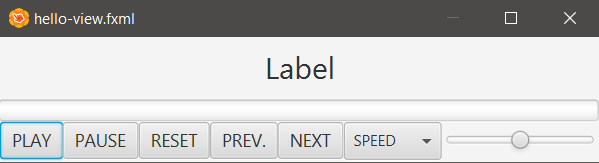
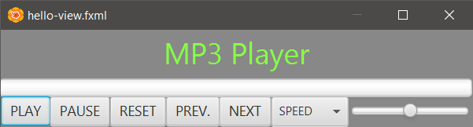
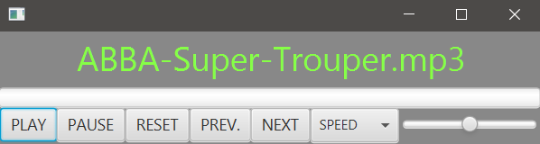
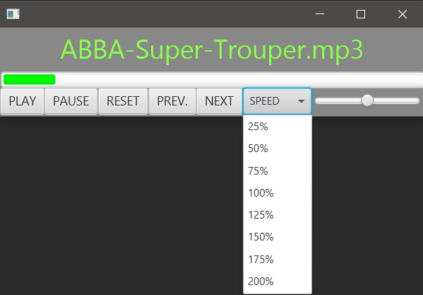

## Description

MP3 Player

### hello-view.fxml in SceneBuilder

- Controller
  - com.sunday.mp3player.HelloController

- Containers
  - AnchorPane (480x100)
    - fx:id: pane

- Controls
  - Label
    - Layout (Stretch horizontally)
      - Pref Width: 480px
      - Pref Height: 50px
    - Text: MP3 Player
    - Alignment: CENTER
    - Font size: 30px
    - fx:id: lbSong
  - ProgressBar
    - Stretch horizontally
    - fx:id: pbarSong
  - Button
    - Text: PLAY / fx:id: btnPlay / onAction: playMedia
    - Text: PAUSE / fx:id: btnPause / onAction: pauseMedia
    - Text: RESET / fx:id: btnReset / onAction: resetMedia
    - Text: PREV. / fx:id: btnPrevious / onAction: previousMedia
    - Text: NEXT / fx:id: btnNext / onAction: nextMedia
  - ComboBox
    - Text: SPEED / fx:id: cboxSpeed / onAction: changeSpeed
  - Slider
    - fx:id: sliVolume / Min: 0 / Max: 100 / Value: 50

**Some changes**

- AnchorPane (480x100)
  - Style: -fx-background-color: #888
- Label
  - Text fill: #87ff47

### pom.xml

Add the dependency.

~~~
    <dependency>
        <groupId>org.openjfx</groupId>
        <artifactId>javafx-media</artifactId>
        <version>18-ea+2</version>
    </dependency>
~~~

### module-info.java

~~~
module com.sunday.mp3player {
    requires javafx.controls;
    requires javafx.fxml;
    requires javafx.media;

    opens com.sunday.mp3player to javafx.fxml;
    exports com.sunday.mp3player;
}
~~~

### HelloController.java

In 'resources/music' there are three songs (.mp3).  
So far, the name of the first song is displayed in the mp3-player.

~~~
public class HelloController implements Initializable {

    @FXML
    private AnchorPane pane;
    @FXML
    private Label lbSong;
    @FXML
    private Button btnPlay, btnPause, btnReset, btnPrevious, btnNext;
    @FXML
    private ComboBox<String> cboxSpeed;
    @FXML
    private Slider sliVolume;
    @FXML
    private ProgressBar pbarSong;

    // directory of music
    private File directory;
    private File[] files;
    private ArrayList<File> songs; // playlist

    private int songNumber;
    private int[] speeds = {25,50,75,100,125,150,175,200};

    // keep track of the progress-bar and will be updated every second
    private Timer timer;
    private TimerTask task;
    private boolean running; // true if the mp3-player is playing

    private Media media;
    private MediaPlayer player;

    @Override
    public void initialize(URL url, ResourceBundle resourceBundle) {
        // initialize the ArrayList
        songs = new ArrayList<File>();

        // option-1
        // ClassLoader classLoader = getClass().getClassLoader();
        // directory = new File(classLoader.getResource("music").getFile());
        // option-2
        // directory = new File("D:\\01-EVE\\CURSOS\\15-JavaFX2\\JavaFX\\Mp3Player\\src\\main\\resources\\music");
        // option-3
        directory = new File("Mp3Player/src/main/resources/music");
        files = directory.listFiles(); // get the files in 'directory' ('music' folder)
        if(files != null) {
            for(File file : files) {
                songs.add(file);
                // System.out.println(file); // prints in the console:
                // Mp3Player\src\main\resources\music\ABBA-Super-Trouper.mp3
                // Mp3Player\src\main\resources\music\ACDC-ThunderStruck.mp3
                // Mp3Player\src\main\resources\music\Barry-White-Just-the-way-you-are.mp3
            }
        }

        media = new Media(songs.get(songNumber).toURI().toString());
        player = new MediaPlayer(media);

        lbSong.setText(songs.get(songNumber).getName());
    }

    public void playMedia() {
    }
    public void pauseMedia() {
    }
    public void resetMedia() {
    }
    public void previousMedia() {
    }
    public void nextMedia() {
    }
    public void changeSpeed(ActionEvent event) {
    }
    public void beginTimer() {
    }
    public void cancelTimer() {
    }
}
~~~

### HelloController.java - play, pause, reset, previous, next

~~~
    public void playMedia() {
        player.play();
    }
    public void pauseMedia() {
        player.pause();
    }
    public void resetMedia() {
        player.seek(Duration.seconds(0));
    }
    public void previousMedia() {
        // if the last song is reached, the 'next' button does nothing
        if(songNumber > 0) {
            songNumber--;
            player.stop();
            media = new Media(songs.get(songNumber).toURI().toString());
            player = new MediaPlayer(media);
            lbSong.setText(songs.get(songNumber).getName());
            // to play automatically after 'next' button is pressed
            playMedia();
        }
        // when the last song is reached, the 'next' button goes to the first song
        else {
            songNumber = songs.size() -1;
            player.stop();
            media = new Media(songs.get(songNumber).toURI().toString());
            player = new MediaPlayer(media);
            lbSong.setText(songs.get(songNumber).getName());
            // to play automatically after 'next' button is pressed
            playMedia();
        }
    }
    public void nextMedia() {
        // if the last song is reached, the 'next' button does nothing
        if(songNumber < songs.size()-1) {
            songNumber++;
            player.stop();
            media = new Media(songs.get(songNumber).toURI().toString());
            player = new MediaPlayer(media);
            lbSong.setText(songs.get(songNumber).getName());
            // to play automatically after 'next' button is pressed
            playMedia();
        }
        // when the last song is reached, the 'next' button goes to the first song
        else {
            songNumber = 0;
            player.stop();
            media = new Media(songs.get(songNumber).toURI().toString());
            player = new MediaPlayer(media);
            lbSong.setText(songs.get(songNumber).getName());
            // to play automatically after 'next' button is pressed
            playMedia();
        }
    }
~~~

### HelloController.java - change speed

At the end of 'initialize()' add:

~~~
    // to populate the combo-box and link an action
    for(int i=0; i < speeds.length; i++) {
        cboxSpeed.getItems().add(Integer.toString(speeds[i]) + "%");
    }
    cboxSpeed.setOnAction(e -> changeSpeed(e)); // (this::changeSpeed)
~~~

The 'changeSpeed()' method

~~~
    public void changeSpeed(ActionEvent event) {
        // if the '%' hadn't been added in the combo-box:
        // player.setRate(Integer.parseInt(cboxSpeed.getValue()) * 0.01);
        // with the '%' added
        player.setRate(Integer.parseInt(cboxSpeed.getValue().substring(0,cboxSpeed.getValue().length()-1)) * 0.01);
    }
~~~

There is one issue, if a song is being played at 200% of speed, when 'previous' or 'next' button is pressed, the other song will be played at 100% of speed, even when the combo-box still says it's at 200%.  
To fix this, a little change should be made:

~~~
    public void playMedia() {
        changeSpeed(null);  // <---
        player.play();
    }
~~~

This change causes an issue. If 'previous' or 'next' is pressed at the beginning, as the 'cboxSpeed' haven't been initialized it's null.  
And, int the 'changeSpeed()' would throw an exception because it's multiplying 'null' by 0.01.
So, the solution is:

~~~
    public void changeSpeed(ActionEvent event) {
        if(cboxSpeed.getValue() == null) {
            player.setRate(1);
        } else {
            // if the '%' hadn't been added in the combo-box:
            // player.setRate(Integer.parseInt(cboxSpeed.getValue()) * 0.01);
            // with the '%' added
            player.setRate(Integer.parseInt(cboxSpeed.getValue().substring(0,cboxSpeed.getValue().length()-1)) * 0.01);
        }
    }
~~~

### HelloController.java - Volume

At the end of initialize()

~~~
    sliVolume.valueProperty().addListener( (var1,var2,var3) -> {
        player.setVolume(sliVolume.getValue() * 0.01);
    });
~~~

### HelloController.java - Progress bar

The work is done by the beginTimer() and endTimer() methods.
They are used in other methods.  
All the code:

~~~
public class HelloController implements Initializable {

    @FXML
    private AnchorPane pane;
    @FXML
    private Label lbSong;
    @FXML
    private Button btnPlay, btnPause, btnReset, btnPrevious, btnNext;
    @FXML
    private ComboBox<String> cboxSpeed;
    @FXML
    private Slider sliVolume;
    @FXML
    private ProgressBar pbarSong;

    // directory of music
    private File directory;
    private File[] files;
    private ArrayList<File> songs; // playlist

    private int songNumber;
    private int[] speeds = {25,50,75,100,125,150,175,200};

    // keep track of the progress-bar and will be updated every second
    private Timer timer;
    private TimerTask task;
    private boolean running; // true if the mp3-player is playing

    private Media media;
    private MediaPlayer player;

    @Override
    public void initialize(URL url, ResourceBundle resourceBundle) {
        // initialize the ArrayList
        songs = new ArrayList<File>();

        // option-1
        // ClassLoader classLoader = getClass().getClassLoader();
        // directory = new File(classLoader.getResource("music").getFile());
        // option-2
        // directory = new File("D:\\01-EVE\\CURSOS\\15-JavaFX2\\JavaFX\\Mp3Player\\src\\main\\resources\\music");
        // option-3
        directory = new File("Mp3Player/src/main/resources/music");
        files = directory.listFiles(); // get the files in 'directory' ('music' folder)
        if(files != null) {
            for(File file : files) {
                songs.add(file);
                // System.out.println(file); // prints in the console:
                // Mp3Player\src\main\resources\music\ABBA-Super-Trouper.mp3
                // Mp3Player\src\main\resources\music\ACDC-ThunderStruck.mp3
                // Mp3Player\src\main\resources\music\Barry-White-Just-the-way-you-are.mp3
            }
        }

        media = new Media(songs.get(songNumber).toURI().toString());
        player = new MediaPlayer(media);
        lbSong.setText(songs.get(songNumber).getName());

        // COMBO-BOX: to populate the combo-box
        for(int i=0; i < speeds.length; i++) {
            cboxSpeed.getItems().add(Integer.toString(speeds[i]) + "%");
        }
        cboxSpeed.setOnAction(e -> changeSpeed(e)); // (this::changeSpeed)

        // VOLUME
        sliVolume.valueProperty().addListener( (var1,var2,var3) -> {
            player.setVolume(sliVolume.getValue() * 0.01);
        });

        // PROGRESS-BAR COLOR
        pbarSong.setStyle("-fx-accent: #0f0;");

    }

    public void playMedia() {
        beginTimer(); // TIMER
        changeSpeed(null);
        // if the volume was in 0, and then press 'play', the song started at 50% (volume), and the slider still was in 0. This fix that:
        player.setVolume(sliVolume.getValue() * 0.01);
        player.play();
    }
    public void pauseMedia() {
        cancelTimer(); // TIMER
        player.pause();
    }
    public void resetMedia() {
        pbarSong.setProgress(0); // TIMER
        player.seek(Duration.seconds(0));
    }
    public void previousMedia() {
        // if the last song is reached, the 'next' button does nothing
        if(songNumber > 0) {
            songNumber--;
            player.stop();

            // TIMER
            if(running) {
                cancelTimer();
            }

            media = new Media(songs.get(songNumber).toURI().toString());
            player = new MediaPlayer(media);
            lbSong.setText(songs.get(songNumber).getName());
            // to play automatically after 'next' button is pressed
            playMedia();
        }
        // when the last song is reached, the 'next' button goes to the first song
        else {
            songNumber = songs.size() -1;
            player.stop();

            // TIMER
            if(running) {
                cancelTimer();
            }

            media = new Media(songs.get(songNumber).toURI().toString());
            player = new MediaPlayer(media);
            lbSong.setText(songs.get(songNumber).getName());
            // to play automatically after 'next' button is pressed
            playMedia();
        }
    }
    public void nextMedia() {
        // if the last song is reached, the 'next' button does nothing
        if(songNumber < songs.size()-1) {
            songNumber++;
            player.stop();

            // TIMER
            if(running) {
                cancelTimer();
            }

            media = new Media(songs.get(songNumber).toURI().toString());
            player = new MediaPlayer(media);
            lbSong.setText(songs.get(songNumber).getName());
            // to play automatically after 'next' button is pressed
            playMedia();
        }
        // when the last song is reached, the 'next' button goes to the first song
        else {
            songNumber = 0;
            player.stop();

            // TIMER
            if(running) {
                cancelTimer();
            }

            media = new Media(songs.get(songNumber).toURI().toString());
            player = new MediaPlayer(media);
            lbSong.setText(songs.get(songNumber).getName());
            // to play automatically after 'next' button is pressed
            playMedia();
        }
    }
    public void changeSpeed(ActionEvent event) {
        if(cboxSpeed.getValue() == null) {
            player.setRate(1);
        } else {
            // if the '%' hadn't been added in the combo-box:
            // player.setRate(Integer.parseInt(cboxSpeed.getValue()) * 0.01);
            // with the '%' added
            player.setRate(Integer.parseInt(cboxSpeed.getValue().substring(0,cboxSpeed.getValue().length()-1)) * 0.01);
        }
    }
    public void beginTimer() {
        timer = new Timer();
        task = new TimerTask() {
            @Override
            public void run() {
                running = true;
                double current = player.getCurrentTime().toSeconds();
                double end = media.getDuration().toSeconds();
                // System.out.println(current/end);
                pbarSong.setProgress(current/end);
                // once the song has finished, the 'timer' should be canceled
                if(current/end == 1) {
                    cancelTimer();
                }
            }
        };
        timer.scheduleAtFixedRate(task, 0, 1000); // (task, delay, period: time to repeat the task)
    }
    public void cancelTimer() {
        running = false;
        timer.cancel();
    }
}
~~~

### HelloApplication.java

~~~
public class HelloApplication extends Application {
    @Override
    public void start(Stage stage) throws IOException {
        FXMLLoader fxmlLoader = new FXMLLoader(HelloApplication.class.getResource("hello-view.fxml"));
        Scene scene = new Scene(fxmlLoader.load());
        stage.setScene(scene);
        stage.show();

        stage.setOnCloseRequest( (var) -> {
            // Anything to be done when the [X] button is pressed, goes here.
            Platform.exit();
            System.exit(0);
        });
    }

    public static void main(String[] args) {
        launch();
    }
}
~~~

### TO-DO
- When a song finishes, it doesn't play the next one automatically.

