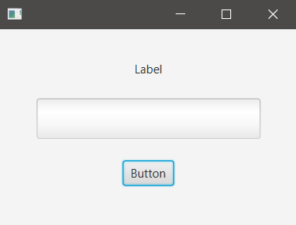
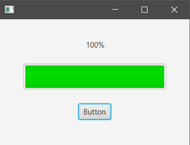

## Description

When a button is clicked the ProgressBar will increase a bit.

### hello-view.fxml in SceneBuilder

- Containers
  - AnchorPane (300x200)

- Controls
  - ProgressBar
    - Redimension de control
    - Progress: 0.0 (from 0 to 1)
    - fx:id: pbarIncrease
  - Button
    - fx:id: btnIncrease
    - onAction: increaseProgress
  - Label
    - fx:id: lbIncrease

- Controller
  - com.sunday.progressbar.HelloController

### HelloController.java

It's not recommended to use *double* when there'll be a lot of calculations, eventually it'll lose precision.  
I.e. if `progress` is `double`, then executing many times: `progress += 0.1;` will be:
- 0.1
- 0.2
- 0.30000000000000004
- 0.4
- 0.5
- 0.6
- 0.7
- 0.79999999999999999
- 0.89999999999999999

So, it's better to use `BigDecimal`. Nevertheless, part of the code used in the video is throwing NumberFormatException in the BigDecimal constructor.  
This is the code used in the video for the controller:

~~~
public class HelloController implements Initializable{

	@FXML
	private ProgressBar pbarIncrease;
	@FXML
	private Label lbIncrease;
	
	// This line threw NumberFormaException, because of the constructor
	BigDecimal progress = new BigDecimal(String.format("%.2f", 0.0));
	
	@Override
	public void initialize(URL arg0, ResourceBundle arg1) {
		pbarIncrease.setStyle("-fx-accent: #00FF00;");
	}
	
	public void increaseProgress() {
		if(progress.doubleValue() < 1) {
			progress = new BigDecimal(String.format("%.2f", progress.doubleValue() + 0.1));
			pbarIncrease.setProgress(progress.doubleValue());
			lbIncrease.setText(Integer.toString((int)Math.round(progress.doubleValue() * 100)) + "%");
		}
	}
}
~~~

As it didn't work for me, I use *double* but with an extra method to avoid the loss of precision.

~~~
public class HelloController implements Initializable {
    @FXML
    private ProgressBar pbarIncrease;
    @FXML
    private Label lbIncrease;

    private double progress;

    @Override
    public void initialize(URL url, ResourceBundle resourceBundle) {
        pbarIncrease.setStyle("-fx-accent: #00DD00;");
    }

    public void increaseProgress() { // button onAction
        progress = m(progress);
        if(progress < 1) {
            progress = progress+0.1;
            pbarIncrease.setProgress(m(progress));
            // show increment on label.
            lbIncrease.setText((int)(m(progress)*100) + "%");
        }
    }
    private double m(double d) {
        return (Math.round(d*10))/10.0;
    }
}
~~~

**On execution**

***Initial view***

***100%***  
