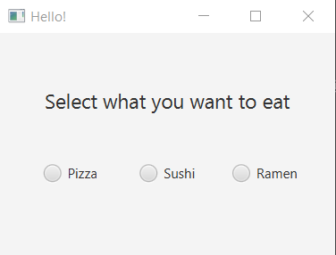
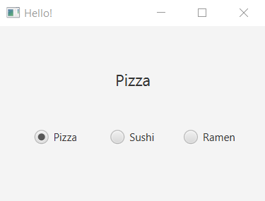

### START

When clicking on radio-buttons their text will be display on a label. It is like selecting the menu, only one item can be chosen.

### hello-view.fxml in SceneBuilder

- Containers
  - AnchorPane 

- Controls
  - RadioButton
    - Text: Pizza / Toggle Group: food / fx:id: rbtnPizza / onAction: getFood
    - Text: Sushi / Toggle Group: food / fx:id: rbtnSushi / onAction: getFood
    - Text: Ramen / Toggle Group: food / fx:id: rbtnRamen / onAction: getFood
  - Label
    - Text: Select what you want to eat
    - Font: 18px
    - Allignment: CENTER (stretch the borders of the label)
    - fx:id: lbFood

- Controller
  - com.sunday.radiobutton.HelloController

### HelloController.java

~~~
public class HelloController {
    @FXML
    private Label lbFood;
    @FXML
    private RadioButton rbtnPizza, rbtnSushi, rbtnRamen;

    public void getFood(ActionEvent event) {

        if(rbtnPizza.isSelected()) {
            lbFood.setText(rbtnPizza.getText());
        }else if(rbtnSushi.isSelected()) {
            lbFood.setText(rbtnSushi.getText());
        }else if(rbtnRamen.isSelected()) {
            lbFood.setText(rbtnRamen.getText());
        }
    }
}
~~~

**On execute**

***Select food***

***Pizza selected***

