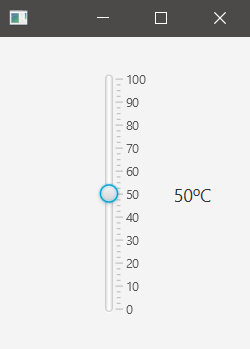
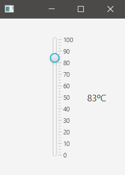

## Description

There are vertical and horizontal slider.  
It will be used as a temperature regulator from 0 to 100 ºC.

### hello-view.fxml in SceneBuilder

- Containers
  - AnchorPane (200x250)

- Controls
  - Slider (vertical)
    - Min and Max by default are 0 and 100.
    - Value: 50 (initial value)
    - Block increment: 10
    - Show tick marks: checked
    - Show tick labels: checked
    - Major tick unit: 10 (labels increment)
    - Minor tick count: 3 (lines of separation between major ticks)
    - fx:id: sldTemperature
    - It doesn't have 'onAction'
  - Label
    - Font size: 14px
    - fx:id: lbTemperature

- Controller
  - com.sunday.slider.HelloController

### HelloController.java

It uses a change-listener for the Slider so we need the Initializable interface.  
Note the way Lambda is used.

~~~
public class HelloController implements Initializable {
    @FXML
    private Label lbTemperature;
    @FXML
    private Slider sldTemperature;

    int temperature;

    @Override
    public void initialize(URL url, ResourceBundle resourceBundle) {

        temperature = (int) sldTemperature.getValue();
        lbTemperature.setText(Integer.toString(temperature) + "ºC");

        /*
        // Before Lambda, anonymous classes were used, in this case, an instance of the functional interface: ChangeListener
        // The code with anonymous-class would be like this
        sldTemperature.valueProperty().addListener(new ChangeListener<Number>() {
            @Override
            public void changed(ObservableValue<? extends Number> observableValue, Number number, Number t1) {
                // slider current value
                temperature = (int) sldTemperature.getValue();
                lbTemperature.setText(Integer.toString(temperature) + "ºC");
            }
        });
        */

        /*
        Knowing that the functional interface is like this.. It'd be better to use Lambda.
            @FunctionalInterface
            public interface ChangeListener<T> {
                void changed(ObservableValue<? extends T> var1, T var2, T var3);
            }
        */
        
        // By using IntelliJ it helps with the conversion. 
        // Note that we're not using any of the arguments, so the first line could be:
        //    sldTemperature.valueProperty().addListener((var1, var2, var3) -> {
        // But, this is the way IntelliJ did the conversion.
        sldTemperature.valueProperty().addListener((observableValue, number, t1) -> {
            // slider current value
            temperature = (int) sldTemperature.getValue();
            lbTemperature.setText(Integer.toString(temperature) + "ºC");
        });
    }
}
~~~

**On execution**

***Initial view***  

***Value selected***  

A