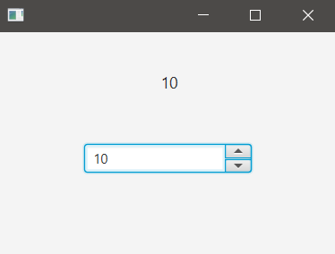

## Descripción

The Spinner contains a list of values we can choose by clicking its arrows.  
For this example, the value in the Spinner will be display in a Label.

### hello-view.fxml in SceneBuilder

- Containers
  - AnchorPane (300x200)
  

- Controls:
  - Spinner
    - fx:id: spiNumbers
  - Label
    - Font size: 14px
    - Stretch the borders of the label
    - Allignment: CENTER
    - fx:id: lbNumbers

- Controller
  - com.sunday.spinner.HelloController

### HelloController.java - Testing the Spinner

- It uses the `SpinnerValueFactory` is the model behind the JavaFX Spinner control, without a value factory installed a Spinner is unusable.  
- It is th role of the value factory to handle almost all aspects of the Spinner, including:
  - Representing the current state of the value.
  - Incrementing and decrementing the value, with one or more steps per call.
  - Converting text input from the user (via the Spinner editor).
  - Converting objects to user-readable strings for display on screen.

On execution it's possible to go from 1 to 10 in the Spinner.
~~~
public class HelloController implements Initializable {
    @FXML
    private Spinner<Integer> spiNumbers;
    @FXML
    private Label lbNumbers;

    int currentValue;

    @Override
    public void initialize(URL url, ResourceBundle resourceBundle) {
        // numbers from 1 to 10
        SpinnerValueFactory<Integer> valueFactory =
                new SpinnerValueFactory.IntegerSpinnerValueFactory(1,10);
        // Set the initial value
        valueFactory.setValue(1);
        // add the valueFactory to the Spinner
        spiNumbers.setValueFactory(valueFactory);
    }
}
~~~

### HelloController.java - Final version

~~~
public class HelloController implements Initializable {
    @FXML
    private Spinner<Integer> spiNumbers;
    @FXML
    private Label lbNumbers;

    int currentValue;

    @Override
    public void initialize(URL url, ResourceBundle resourceBundle) {
        // numbers from 1 to 10
        SpinnerValueFactory<Integer> valueFactory =
                new SpinnerValueFactory.IntegerSpinnerValueFactory(1,10);
        // Set the initial value
        valueFactory.setValue(1);
        // add the valueFactory to the Spinner
        spiNumbers.setValueFactory(valueFactory);

        // The label is in '1', despite the spinner is in another number
        currentValue = spiNumbers.getValue();
        lbNumbers.setText(Integer.toString(currentValue));

        // Listener to update the label when the spinner changes
        spiNumbers.valueProperty().addListener( (var1,var2,var3) -> {
            currentValue = spiNumbers.getValue();
            lbNumbers.setText(Integer.toString(currentValue));
        });
    }
}
~~~

**On execution**

***Initial view***

***Maximum value***

