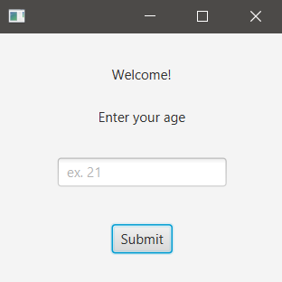
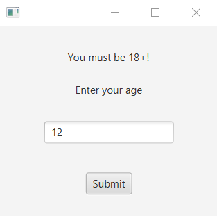
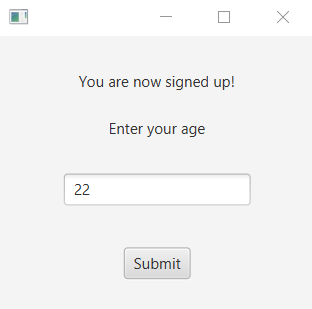
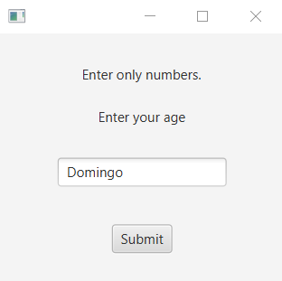

## START
This app requires the age of the user. It only allow access to 18 year old user or older.   
It will show a message depending on the age.

### hello-view.fxml in SceneBuilder

- Containers
  - AnchorPane (220x250)  

- Controls
  - Label
    - Texto: Welcome! / fx:id: lbWelcome
    - Texto: Enter your age / it doesn't have fx:id
  - TextField:
    - Texto: ex. 21 / fx:id: tfAge
  - Button
    - Texto: Submit / fx:id: btnSubmit / onAction: submit

- Controller
  - com/sunday/textfield/HelloController.java

### HelloApplication.java

~~~
public class HelloApplication extends Application {
    @Override
    public void start(Stage stage) throws IOException {
        FXMLLoader fxmlLoader = new FXMLLoader(HelloApplication.class.getResource("hello-view.fxml"));
        Scene scene = new Scene(fxmlLoader.load());
        stage.setScene(scene);
        stage.show();
    }

    public static void main(String[] args) {
        launch();
    }
}
~~~

### HelloController.java - Managing exceptions

Initial code for testing: the number entered in the TextField will be shown in the Console.

~~~
public class HelloController {

    @FXML
    private Label lbWelcome;
    @FXML
    private TextField tfAge;
    @FXML
    private Button btnSubmit;

    private int age;

    public void submit(ActionEvent event) {
        age = Integer.parseInt(tfAge.getText());
        System.out.println(age);
    }
}
~~~

In the preceding code, if characters entered can't be converted to Integer, it will throw an exception.  
Now, with the try..catch, it will show the exception in the Console, i.e. if 'Domingo' is entered, it will show: `java.lang.NumberFormatException: For input string: "Domingo"`

~~~
    public void submit(ActionEvent event) {
        try {
            age = Integer.parseInt(tfAge.getText());
            System.out.println(age);
        } catch (Exception e) {
            System.out.println(e);
        }
    }
~~~

Now, it captures the exception it found: `NumberFormatException`  
It shows an appropriate message in the Console, so the application doesn't collapse.

~~~
    public void submit(ActionEvent event) {
        try {
            age = Integer.parseInt(tfAge.getText());
            System.out.println(age);
        } catch (NumberFormatException e) {
            System.out.println("Enter only numbers.");
        } catch (Exception e) {
            System.out.println(e);
        }
    }
~~~

### HelloController.java - It shows a message depending on the age entered

~~~
public class HelloController {

    @FXML
    private Label lbWelcome;
    @FXML
    private TextField tfAge;
    @FXML
    private Button btnSubmit;

    private int age;

    public void submit(ActionEvent event) {
        try {
            age = Integer.parseInt(tfAge.getText());
            // System.out.println(age);
            if(age >= 18)
                lbWelcome.setText("You are now signed up!");
            else
                lbWelcome.setText("You must be 18+!");
        } catch (NumberFormatException e) {
            // System.out.println("Enter only numbers.");
            lbWelcome.setText("Enter only numbers.");
        } catch (Exception e) {
            // System.out.println(e);
            lbWelcome.setText("Error");
        }
    }
}
~~~

### Run code

***Initial view***  

***Less than 18***  

***18 or more***  

***Text entered, should be number***  

