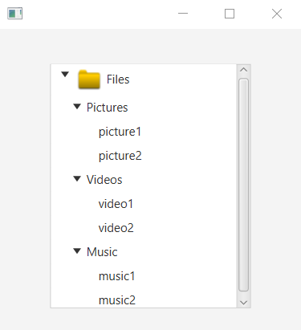

## Description

TreeView displays hierarchical data on a tree-structure.
It can be seen as real trees: root, branches, leaves

### hello-view.fxml in SceneBuilder

- Containers
  - AnchorPane (300x300)

- Controls
  - TreeView
    - fx:id: trviFood
    - To control the item selection
      - On Context Menu Requested: selectItem (method called when an item is selected)
      - On mouse clicked: selectItem

- Controller
  - com.sunday.treeview.HelloController

### HelloController.java - Exception

- This code displays the TreeView.

~~~
public class HelloController implements Initializable {
    @FXML
    private TreeView treeView;

    @Override
    public void initialize(URL url, ResourceBundle resourceBundle) {
        // Creating tree-items to add to the tree-view
        // root-item
        TreeItem<String> rootItem = new TreeItem<>("Files");
        // branch-items
        TreeItem<String> branchItem1 = new TreeItem<>("Pictures");
        TreeItem<String> branchItem2 = new TreeItem<>("Videos");
        TreeItem<String> branchItem3 = new TreeItem<>("Music");
        // branch-items
        TreeItem<String> leafItem1 = new TreeItem<>("picture1");
        TreeItem<String> leafItem2 = new TreeItem<>("picture2");
        TreeItem<String> leafItem3 = new TreeItem<>("video1");
        TreeItem<String> leafItem4 = new TreeItem<>("video2");
        TreeItem<String> leafItem5 = new TreeItem<>("music1");
        TreeItem<String> leafItem6 = new TreeItem<>("music2");

        // Adding leaf-items to branch-items
        branchItem1.getChildren().addAll(leafItem1, leafItem2);
        branchItem2.getChildren().addAll(leafItem3, leafItem4);
        branchItem3.getChildren().addAll(leafItem5, leafItem6);

        // Adding branch-items to the root-item
        rootItem.getChildren().addAll(branchItem1, branchItem2, branchItem3);

        // Adding the root-item (with its content) to the tree-view
        treeView.setRoot(rootItem);
    }

    public void selectItem() {
        // To store the current-tree-item selected
        TreeItem<String> item = (TreeItem<String>) treeView.getSelectionModel().getSelectedItem();
        System.out.println(item.getValue());
    }
}
~~~ 

Because of the last method: `selectItem()`, it displays correctly on the console the leafItems.  
But, when clicking on the rootItem or branchItems, it displays the exception `NullPointerException` because it says the item is null.

The reason for the exception is that, when clicking on rootItem or branchItem it shows its content, it's not exactly selected.  
So, the solution for this should be, evaluate the item before displaying it on the Console.  
The `selectItem()` should be like this:

~~~
    public void selectItem() {
        // To store the current-tree-item selected
        TreeItem<String> item = (TreeItem<String>) treeView.getSelectionModel().getSelectedItem();
        if(item != null) {
            System.out.println(item.getValue());
        }
    }
~~~

### HelloController.java - Adding an icon

For example, to add an icon to the Files root-item (considering 'images' folder is in 'resources'):
~~~
    // root-item
    ImageView icon = new ImageView(new Image(getClass().getResourceAsStream("/images/icon.png")));
    TreeItem<String> rootItem = new TreeItem<>("Files", icon);
~~~

**Run the app**

***File icon used***  

***Tree view with file icon***  

