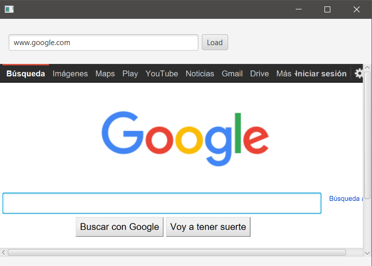
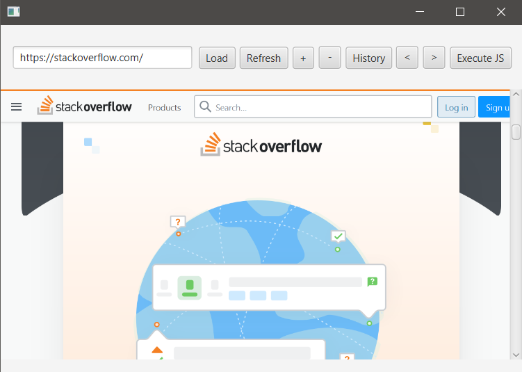

## Description

A WebView it's a node that displays the content of a web engine, meaning that we can display a webpage within our WebView.

### hello-view.fxml in SceneBuilder

- Controller
  - com.sunday.webview.HelloController

- Containers
  - AnchorPane (400x400)

- Controls
  - WebView
    - fx:id: webView
  - Button
    - Text: Load / fx:id: btnLoad / onAction: loadPage
  - TextField
    - fx:id: tfLoad

### pom.xml

As we're going to use 'WebView' .. add the dependency

~~~
    <dependency>
      <groupId>org.openjfx</groupId>
      <artifactId>javafx-web</artifactId>
      <version>18-ea+2</version>
    </dependency>
~~~

### module-info.java

~~~
module com.sunday.webview {
    requires javafx.controls;
    requires javafx.fxml;
    requires javafx.web;
                       
    opens com.sunday.webview to javafx.fxml;
    exports com.sunday.webview;
}
~~~

### HelloController.java

WebView displays the content of a WebEngine.

~~~
public class HelloController implements Initializable {
    @FXML
    private WebView webView;
    @FXML
    private TextField tfLoad;

    private WebEngine engine;
    private String homePage;

    @Override
    public void initialize(URL url, ResourceBundle resourceBundle) {
        // Instantiate the engine
        engine = webView.getEngine();
        homePage = "www.google.com";
        tfLoad.setText(homePage);
        loadPage();
    }

    public void loadPage() {
        // engine.load("http://www.google.com");
        engine.load("http://" + tfLoad.getText());
    }
}
~~~

### HelloController.java - refresh the page

In the SceneBuilder add a Refresh button.
- Controls
  - Button
    - Text: Refresh / fx:id: btnRefresh / onAction: refreshPage

~~~
    public void refreshPage() {
        engine.reload();
    }
~~~

### HelloController.java - zoom

In the SceneBuilder.
- Controls
  - Button
    - Text: + / fx:id: btnZoomIn / onAction: zoomIn
    - Text: - / fx:id: btnZoomOut / onAction: zoomOut

~~~
    public void zoomIn() {
        webView.setZoom(1.25);
    }
    public void zoomOut() {
        webView.setZoom(0.75);
    }
~~~

So far, it only increments or decrements once, we can use a variable..

~~~
public class HelloController implements Initializable {
    // rest of the code
    private double webZoom;

    @Override
    public void initialize(URL url, ResourceBundle resourceBundle) {
        // Instantiate the engine
        engine = webView.getEngine();
        homePage = "www.google.com";
        tfLoad.setText(homePage);
        webZoom = 1;  // <---
        loadPage();
    }
    // rest of the code
    public void zoomIn() {
        webZoom += 0.25;
        webView.setZoom(webZoom);
    }
    public void zoomOut() {
        webZoom -= 0.25;
        webView.setZoom(webZoom);
    }
}
~~~

### HelloController.java - History

In the SceneBuilder.
- Controls
  - Button
    - Text: History / fx:id: btnHistory / onAction: displayHistory

~~~
public class HelloController implements Initializable {
    @FXML
    private WebView webView;
    @FXML
    private TextField tfLoad;

    private WebEngine engine;
    private String homePage; 
    private double webZoom;
    private WebHistory history; // <---

    @Override
    public void initialize(URL url, ResourceBundle resourceBundle) {
        // Instantiate the engine
        engine = webView.getEngine();
        homePage = "www.google.com";
        tfLoad.setText(homePage);
        webZoom = 1;
        loadPage();
    }

    public void loadPage() {
        // engine.load("http://www.google.com");
        engine.load("http://" + tfLoad.getText());
    }

    public void refreshPage() {
        engine.reload();
    }
    public void zoomIn() {
        webZoom += 0.25;
        webView.setZoom(webZoom);
    }
    public void zoomOut() {
        webZoom -= 0.25;
        webView.setZoom(webZoom);
    }
    public void displayHistory() {  // <---
        history = engine.getHistory();
        ObservableList<WebHistory.Entry> entries = history.getEntries();
        for(WebHistory.Entry entry : entries) {
            System.out.println(entry);
        }
    }
}
~~~

After visiting some webpages, when clicking on 'History', it will print in the Console:

>[url: http://www.google.com/, title: Google, date: Thu Sep 01 10:09:41 PET 2022]  
 
>[url: https://www.wordreference.com/, title: English to French, Italian, German & Spanish Dictionary - WordReference.com, date: Thu Sep 01 10:10:05 PET 2022]  

>[url: https://stackoverflow.com/, title: Stack Overflow - Where Developers Learn, Share, & Build Careers, date: Thu Sep 01 10:10:23 PET 2022]

**Making some changes**

~~~
    public void displayHistory() {
        history = engine.getHistory();
        ObservableList<WebHistory.Entry> entries = history.getEntries();
        for(WebHistory.Entry entry : entries) {
            System.out.println(entry.getUrl() + " " + entry.getLastVisitedDate());
        }
    }
~~~

>http://www.google.com/ Thu Sep 01 10:14:46 PET 2022  

>https://www.wordreference.com/ Thu Sep 01 10:14:58 PET 2022  

>https://stackoverflow.com/ Thu Sep 01 10:15:10 PET 2022

### HelloController.java - Moving back and forward

In the SceneBuilder.
- Controls
  - Button
    - Text: < / onAction: back
    - Text: > / onAction: forward

~~~
    public void back() {
        history = engine.getHistory();
        ObservableList<WebHistory.Entry> entries = history.getEntries();
        history.go(-1);
        // to change the URL displayed (because it didn't change when moving back and forward)
        tfLoad.setText(entries.get(history.getCurrentIndex()).getUrl());
    }
    public void forward() {
        history = engine.getHistory();
        ObservableList<WebHistory.Entry> entries = history.getEntries();
        history.go(+1);
        tfLoad.setText(entries.get(history.getCurrentIndex()).getUrl());
    }
~~~

### HelloController.java - Execute JavaScript

This works like an icon to go directly to a webpage, i.e. 'www.youtube.com'

In the SceneBuilder add a Refresh button.
- Controls
  - Button
    - Text: Execute JS / onAction: executeJS

~~~
    public void executeJS() {
        engine.executeScript("window.location = \"https://www.youtube.com\";");
        tfLoad.setText("www.youtube.com");
    }
~~~

