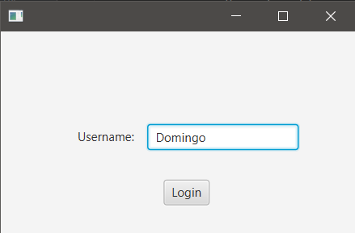
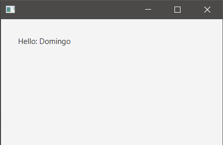

## INICIO

**HelloApplication.java**
~~~
public class HelloApplication extends Application {
    @Override
    public void start(Stage stage) throws IOException {
        Parent root = FXMLLoader.load(getClass().getResource("scene1.fxml"));
        Scene scene = new Scene(root);
        stage.setScene(scene);
        stage.show();
    }

    public static void main(String[] args) {
        launch();
    }
}
~~~

Crear: scene1.fxml, scene2.fxml, Scene1Controller.java, Scene2Controller.java

**scene1.fxml en SceneBuilder**
- Containers -> AnchorPane -> 200x350
- Controller
  - com.sunday.controllerscommunication.Scene1Controller
- Controls
  - Label: text: Username / fx:id: lbUsername
  - TextField: fx:id: tfUsername
  - Button: text: Login / fx:id: btnLogin / Code: onAction: login

**scene2.fxml en SceneBuilder**
- Containers -> AnchorPane -> 200x350
- Controller
  - com.sunday.controllerscommunication.Scene2Controller
- Controls
    - Label: text: Hello / fx:id: lbHello

**Scene2Controller.java**
~~~
public class Scene2Controller {

    @FXML
    Label lbHello;

    public void displayUsername(String username) {
        lbHello.setText("Hello: "+username);
    }
}
~~~

**Scene1Controller.java**
~~~
public class Scene1Controller {
    @FXML
    private TextField tfUsername;

    private Stage stage;
    private Scene scene;
    private Parent root;

    public void login(ActionEvent event) throws IOException {
        // Al presionar el botón se debe capturar el texto en el 'tfUsername'
        String username = tfUsername.getText();

        FXMLLoader loader = new FXMLLoader(getClass().getResource("scene2.fxml"));
        root = loader.load();

        Scene2Controller scene2Controller = loader.getController();
        scene2Controller.displayUsername(username);

        stage = (Stage) ((Node)event.getSource()).getScene().getWindow();
        scene = new Scene(root);
        stage.setScene(scene);
        stage.show();
    }
}
~~~

### Ejecución

***scene1***

***scene2***

