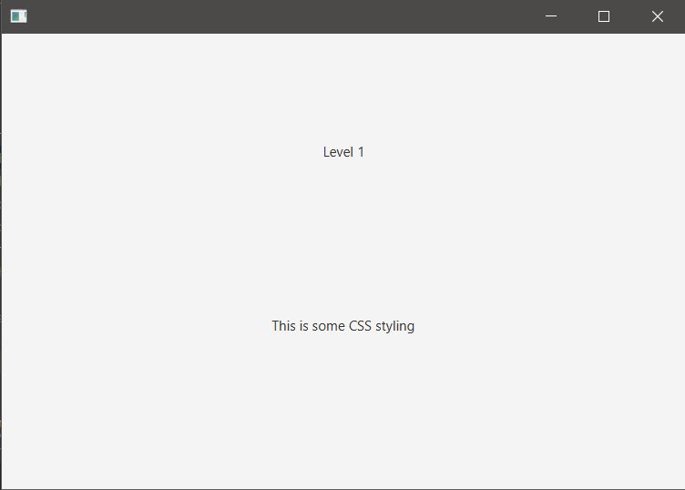
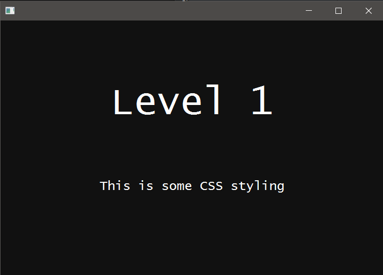

## INICIO

###Vincular .css con el 'scene'
- El archivo .css está en la carpeta: resources -> css

~~~
    public void start(Stage stage) throws IOException {
        FXMLLoader fxmlLoader = new FXMLLoader(HelloApplication.class.getResource("hello-view.fxml"));
        Scene scene = new Scene(fxmlLoader.load());
        scene.getStylesheets().add(getClass().getResource("/css/application.css").toExternalForm()); //*
        stage.setScene(scene);
        stage.show();
    }
~~~

En caso que quisiéramos aplicarle el mismo 'css' a varios Scene's, sería mejor tener la ruta del .css aparte.

~~~
    public void start(Stage stage) throws IOException {
        FXMLLoader fxmlLoader = new FXMLLoader(HelloApplication.class.getResource("hello-view.fxml"));
        Scene scene = new Scene(fxmlLoader.load());
        //scene.getStylesheets().add(getClass().getResource("/images/application.css").toExternalForm());
        String css = this.getClass().getResource("/images/application.css").toExternalForm();
        scene.getStylesheets().add(css);
        // scene2.getStylesheets().add(css);
        // scene3.getStylesheets().add(css);
        stage.setScene(scene);
        stage.show();
    }
~~~

### SceneBuilder

En 'hello-view.fxml' -> Open in SceneBuilder.
- Borrar lo que ya existe.
- Panel izquierdo -> 
  - Containers -> AnchorPane.
  - Controls -> Labels (x2)
    - Label 1: Properties: Text: Level 1 / Code: fx:id: titleLabel
    - Label 2: Properties: Text: This is some CSS styling / Code: fx:id: textLabel
    - File -> Save.
  
Revisar 'hello-view.fxml' para verificar que todo está bien.

### Clase principal: HelloApplication.java

Antes de aplicar edición a application.css, el código debe estar así:

~~~
public class HelloApplication extends Application {
    @Override
    public void start(Stage stage) throws IOException {
        FXMLLoader fxmlLoader = new FXMLLoader(HelloApplication.class.getResource("hello-view.fxml"));
        Scene scene = new Scene(fxmlLoader.load());
        //scene.getStylesheets().add(getClass().getResource("/images/application.css").toExternalForm());
        String css = this.getClass().getResource("/css/application.css").toExternalForm();
        scene.getStylesheets().add(css);
        stage.setScene(scene);
        stage.show();
    }
    /* En el video, el cuerpo del método start() es:
        try {
            Parent root = FXMLLoader.load(getClass().getResource("hello-view.fxml"));
            Scene scene = new Scene(root);
            // resto igual
        } catch(Exception e) {
            e.printStackTrace();
        }
    */
    public static void main(String[] args) {
        launch();
    }
}
~~~

### Estilos CSS aplicados: application.css

~~~
/* Para aplicar estilos al root-node, se indica su clase*/
/* Usualmente se indica la propiedad y el valor */
/* En JavaFX, se antepone el prefijo: -fx- */
.root {
    -fx-background-color: #111; /* o un color sólido, p.e.: "black" */
}
/* Para aplicar estilos a todos los label, se indica su clase*/
.label {
    -fx-font-size: 20;
    -fx-font-family: "Lucida Console";
    -fx-text-fill: "white";
    /* Esto centra el texto en el contenedor del label */
    /* Esto no es suficiente porque el contenedor del label ahora tiene el ancho del text contenido */
    -fx-alignment: center;
    /* En SceneBuilder se expande el ancho de los contenedores de ambos label's */
    /* Guardar cambios en SceneBuilder */
    /* Tal vez sea necesario abrir el .fxml para asegurarnos que están los cambios */
}

#titleLabel {
    -fx-font-size: 60;
}
~~~

A
