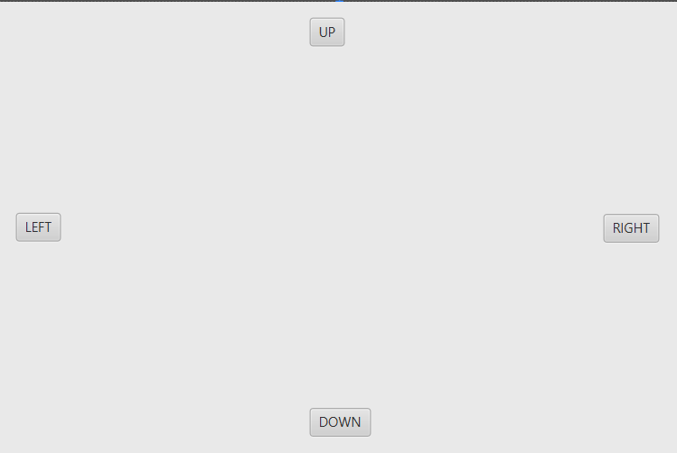
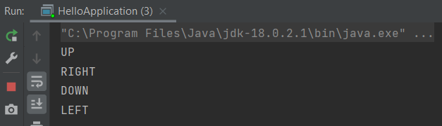
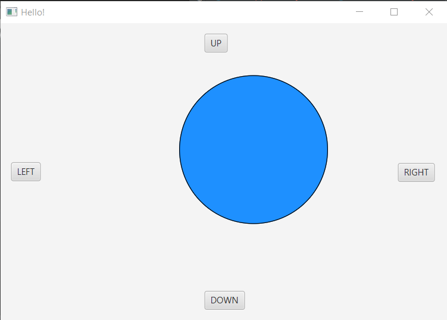

### INICIO

**Al crear el proyecto en IntelliJ se incluyen los archivos**
- HelloApplication.java .. contiene el main().
- HelloController.java .. para los eventos.
- hello-view.fxml .. con la estructura XML.

**La clase HelloApplication.java tiene esta estructura**

~~~
public class HelloApplication extends Application {
    @Override
    public void start(Stage stage) throws IOException {
        // En el video, el código inicial aparece como:
        // Parent root = FXMLLoader.load(getClass().getResource("archivo.fxml"));
        // Scene scene = new Scene(root);
        // stage.setScene(scene);
        // stage.show();
        // Por defecto aparece como:
        FXMLLoader fxmlLoader = new FXMLLoader(HelloApplication.class.getResource("hello-view.fxml"));
        Scene scene = new Scene(fxmlLoader.load(), 320, 240);
        stage.setTitle("Hello!");
        stage.setScene(scene);
        stage.show();
    }

    public static void main(String[] args) {
        launch();
    }
}
~~~

### hello-view.fxml
- Open in SceneBuilder. En 'Hierarchy' borrar todo para empezar de cero.

** Agregar componentes **
- Containers -> AnchorPane
- Controls -> Buttons (4)
  - Se puede cambiar las propiedades.
- File -> Save

### Controller & .fxml

- Aquí se controlan los eventos.
- Usaré la clase que viene por defecto, aunque se puede crear otra.

**Creación de métodos para cada botón**
- Se ejecuta para verificar que funciona correctamente.

~~~
public class HelloController {

    public void up(ActionEvent e) { // javafx.event.ActionEvent
        System.out.println("UP");
    }
    public void down(ActionEvent e) { 
        System.out.println("DOWN");
    }
    public void right(ActionEvent e) { 
        System.out.println("RIGHT");
    }
    public void left(ActionEvent e) { 
        System.out.println("LEFT");
    }
}
~~~

**Asociación de los métodos con los botones**

- Ir al SceneBuilder -> panel izquierdo -> Controller -> Controller class: `com.domingo.eventhandling.HelloController`
- Seleccionar un botón: UP -> panel derecho -> Code -> On action -> `up` (hacer lo mismo con los demás).
- File -> Save.

En `hello-view.fxml` se observa lo que se hizo en el SceneBuilder.

~~~
<?xml version="1.0" encoding="UTF-8"?>

<?import javafx.scene.control.Button?>
<?import javafx.scene.layout.AnchorPane?>

<AnchorPane maxHeight="-Infinity" maxWidth="-Infinity" minHeight="-Infinity" minWidth="-Infinity" prefHeight="400.0" prefWidth="600.0" xmlns="http://javafx.com/javafx/18" xmlns:fx="http://javafx.com/fxml/1" fx:controller="com.domingo.eventhandling.HelloController">
   <children>
      <Button layoutX="274.0" layoutY="14.0" mnemonicParsing="false" onAction="#up" text="UP" />
      <Button layoutX="274.0" layoutY="360.0" mnemonicParsing="false" onAction="#down" text="DOWN" />
      <Button layoutX="14.0" layoutY="187.0" mnemonicParsing="false" onAction="#left" text="LEFT" />
      <Button layoutX="534.0" layoutY="188.0" mnemonicParsing="false" onAction="#right" text="RIGHT" />
   </children>
</AnchorPane>
~~~

**Ejecutar**
- Al hacer click en cada botón, se ejecutará el método asociado.
- Cada método imprime un texto en la Consola.

### Agregando un círculo  

- En el SceneBuilder -> panel izquierdo -> Shapes -> Circle -> arrastrar al centro.
- File -> Save.  
 

- En HelloController, agregar la anotación `@FXML`. Esto hace que el `FXMLLoader` indicado en HelloApplication agregue todo el contenido de `hello-view.fxml` en HelloController.
- Se declara un Circle y variables para las coordenadas del centro.
- Por lo indicado antes, estas variables se corresponden con lo que está en el .fxml.
- Se modifica el contenido de los métodos.

~~~
public class HelloController {

    @FXML
    private Circle myCircle;
    private double x;
    private double y;

    public void up(ActionEvent e) { // javafx.event.ActionEvent
        myCircle.setCenterY(y-=10);
    }

    public void down(ActionEvent e) {
        myCircle.setCenterY(y+=10);
    }

    public void right(ActionEvent e) {
        myCircle.setCenterX(x+=10);
    }

    public void left(ActionEvent e) {
        myCircle.setCenterX(x-=10);
    }
}
~~~

- En SceneBuilder -> seleccionar el círculo -> panel derecho -> fx:id -> myCircle
- File -> Save.
- Se puede verificar en el hello-view.fxml que está el círculo y tiene el fx:id correcto.
- Ejecutar

