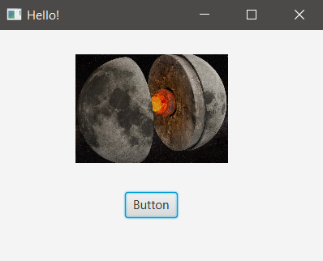

## INICIO

- ImageView is a Node used for painting images loaded with Images.
- Se puede entender como:
  - Image = foto.
  - ImageView = cuadro que contiene la foto. 

### hello-view.fxml in SceneBuilder

En la carpeta: resources/images tengo las imágenes: *alien.jpg & luna.jpg*

La intención es que al hacer clic en el botón intercambie las fotos.

- Containers
  - AnchorPane (200x300)
- Controls 
  - Button -> fx:id: btnFoto
    - onAction: displayImage
  - ImageView -> fx:id: imvFoto 
    - Imagen por defecto: Properties: Image: elegir 'alien.jpg'
- Controller
  - com.sunday.imageview.HelloController

- File -> Save (abrir el .fxml para verificar que guardó los cambios)

### HelloController.java

~~~
public class HelloController {

    @FXML
    private ImageView imvFoto;

    private Image image = new Image(getClass().getResourceAsStream("/images/luna.jpg"));

    // método asociado al botón para cambiar las imágenes
    public void displayImage() {
        // se pone la foto en el cuadro.
        imvFoto.setImage(image);
    }
}
~~~

### Al ejecutar

***Pantalla inicial***

***Al hacer clic en el botón***

**Algunas opciones de ImageView**

- Properties
  - Preserve ratio: para conservar la proporción de las dimensiones.
  - Opacity
  - Cursor: cambia el ícono del cursor al pasar por encima de la imagen.
  - Effect: aplica efectos a la imagen, p.e. sepia

- Layout
  - Layout X, Layout Y: coordenadas X, Y
  - Rotate
  - Scale X, Scale Y: para manejar las proporciones de la imagen.

- Code
  - On Mouse Entered: si se elige 'displayImage' al pasar el mouse la imagen cambiará de 'alien.jpg' a 'luna.jpg'. 
  