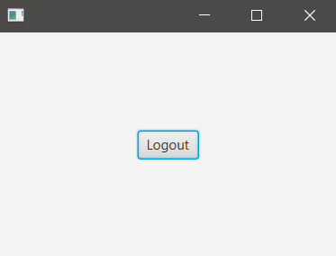
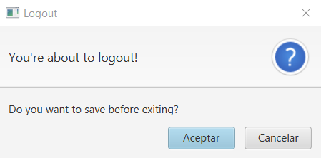

## INICIO

### hello-view.fxml in SceneBuilder

- Containers -> AnchorPane (200x300)
  - fx:id: scenePane
- Controls -> Button
  - text: logout / fx:id: btnLogout / Code: onAction: logout 
- Controller
  - com.sunday.logoutexitbutton.HelloController

### HelloController.java

~~~
public class HelloController {
    @FXML
    private Button btnLogout;
    @FXML
    private AnchorPane scenePane;

    private Stage stage;

    public void logout(ActionEvent event) {
        // Aquí va todo el código a ejecutar antes de cerrar la ventana
        // get the current stage in order to close it
        stage = (Stage) scenePane.getScene().getWindow();
        System.out.println("You successfully logged out!");
        stage.close();
    }
}
~~~

***Usando la clase principal por defecto .. ejecutar***

- Se muestra la ventana y al darle clic al botón 'Logout' ésta se cerrará.
- En la Consola se mostrará el texto: *You successfully logged out!* 

### Pregunta de confirmación antes de cerrar

~~~
public class HelloController {
    @FXML
    private Button btnLogout;
    @FXML
    private AnchorPane scenePane;

    private Stage stage;

    public void logout(ActionEvent event) {
        // Alerta de confirmación
        Alert alert = new Alert(Alert.AlertType.CONFIRMATION);
        alert.setTitle("Logout");
        alert.setHeaderText("You're about to logout!");
        alert.setContentText("Do you want to save before exiting?");

        if(alert.showAndWait().get() == ButtonType.OK) {
            stage = (Stage) scenePane.getScene().getWindow();
            System.out.println("You successfully logged out!");
            stage.close();
        }
    }
}
~~~

***Logout***

***Confirmation***

### Botón 'X' de cierre

Aun es posible cerrar la ventana con el botón superior-derecho [X]  
Para que también pida confirmación para cerrar.

**HelloApplication.java**

With this code the window can be closed in three ways:
- Logout button.
- Upper-right corner [X] button.
- Alt + F4.
~~~
public class HelloApplication extends Application {
    @Override
    public void start(Stage stage) throws IOException {
        FXMLLoader fxmlLoader = new FXMLLoader(HelloApplication.class.getResource("hello-view.fxml"));
        Parent root = fxmlLoader.load();
        Scene scene = new Scene(root);
        stage.setScene(scene);
        stage.show();
        // botón [X] de la parte superior-derecha en la ventana
        // Si solo fuera esta línea, al dar a Cancelar en la Confirmación, el evento se consume igual y se cierra la ventana
        // stage.setOnCloseRequest(event -> logout(stage));
        // Para que no se cierre, se debe detener al event
        stage.setOnCloseRequest(event -> {
            event.consume();
            logout(stage);
        });
    }
    // En HelloController está logout(ActionEvent), aquí es logout(Stage)
    public void logout(Stage stage) {
        // Alerta de confirmación
        Alert alert = new Alert(Alert.AlertType.CONFIRMATION);
        alert.setTitle("Logout");
        alert.setHeaderText("You're about to logout!");
        alert.setContentText("Do you want to save before exiting?");

        if(alert.showAndWait().get() == ButtonType.OK) {
            // no es necesario crear el 'stage' porque éste ya se crea en start()
            // .. y desde start() es pasado a logout()
            // stage = (Stage) scenePane.getScene().getWindow();
            System.out.println("You successfully logged out!");
            stage.close();
        }
    }

    public static void main(String[] args) {
        launch();
    }
}
~~~