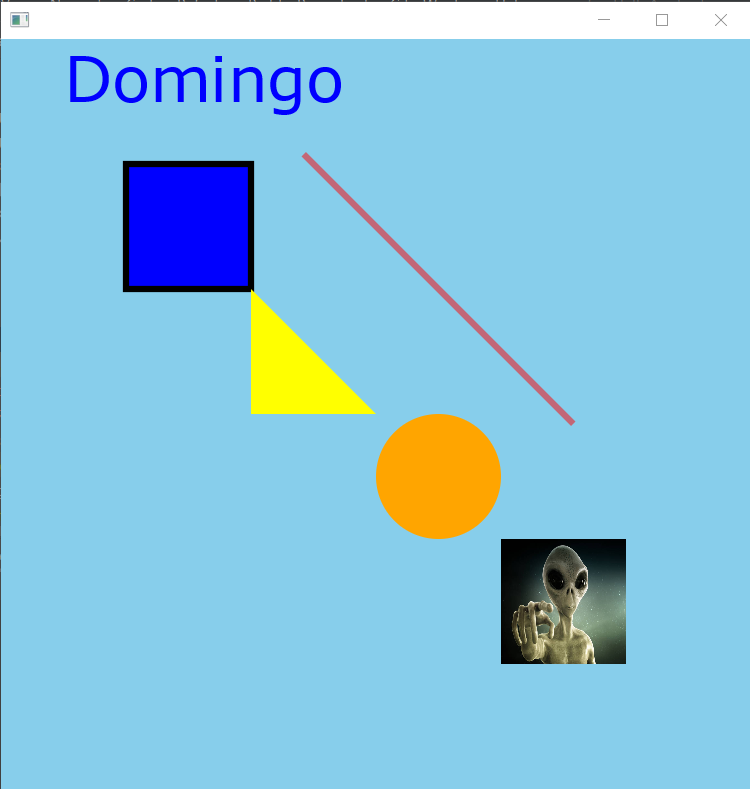

## DIBUJANDO EN EL STAGE  

### Código inicial  

~~~
public class HelloApplication extends Application {
    @Override
    public void start(Stage stage) throws IOException {
        Group root = new Group();
        Scene scene = new Scene(root);
        stage.setScene(scene);
        stage.show();
    }

    public static void main(String[] args) {
        launch();
    }
}
~~~  

### Cambios

- Se puede indicar las dimensiones del 'scene' y un color.  
`Scene scene = new Scene(root, 300, 300, Color.SKYBLUE);`
- El tamaño del 'stage' se redimensionará al tamaño del 'scene'.  

**Agregando texto**

- 'Text' es un tipo de nodo, por lo que se debe agregar al 'root-node'.

~~~
    @Override
    public void start(Stage stage) throws IOException {
        Group root = new Group();
        Scene scene = new Scene(root, 600, 600, Color.SKYBLUE);

        Text text = new Text();
        text.setText("Domingo");
        text.setX(50);
        text.setY(50);
        text.setFont(Font.font("Verdana", 50)); // (fuente,tamaño)
        text.setFill(Color.BLUE); // Color de texto
        root.getChildren().add(text);

        stage.setScene(scene);
        stage.show();
    }
~~~

**Agregando Líneas**

- 'Line' también es un tipo de nodo, se debe agregar al 'root-node'.
~~~
        Line line = new Line();
        line.setStartX(200);
        line.setStartY(200);
        line.setEndX(500);
        line.setEndY(200); // línea horizontal
        line.setStrokeWidth(5); // grosor de línea
        line.setStroke(Color.RED);
        line.setOpacity(0.5); // transparencia al 50%
        line.setRotate(45); // 45º, el punto final gira horario respecto al punto inicial
                            // línea diagonal derecha inferior
        root.getChildren().add(line);
~~~

**Agregando Rectángulos**

~~~
        Rectangle rectangle = new Rectangle();
        rectangle.setX(100);
        rectangle.setY(100);
        rectangle.setWidth(100);
        rectangle.setHeight(100); // se forma un cuadrado
        rectangle.setFill(Color.BLUE); // por defecto es negro
        rectangle.setStrokeWidth(5); // grosor de línea de borde
        rectangle.setStroke(Color.BLACK); // color de línea de borde

        root.getChildren().add(rectangle);
~~~

**Agregando Polígonos (triángulo)**

- Ya que un triángulo tiene 3 vértices, se debe ingresar las coordenadas de esos 3 puntos.

~~~
        Polygon triangle = new Polygon();
        triangle.getPoints().setAll(
                200.0, 200.0,
                300.0, 300.0,
                200.0, 300.0
        );
        triangle.setFill(Color.YELLOW);

        root.getChildren().add(triangle);
~~~

**Agregando Círculos**

~~~
        // CÍRCULOS
        Circle circle = new Circle();
        circle.setCenterX(350);
        circle.setCenterY(350);
        circle.setRadius(50);
        circle.setFill(Color.ORANGE);
        
        root.getChildren().add(circle);
~~~

**Agregando Imágenes**

- Si se indica el 'absolute-path' de la imagen, acepta solo el String.
- Si es un 'relative-path', no me permite solo el String, sino que hace falta todo el código indicado.

~~~
        Image image = new Image(HelloApplication.class.getResource("/images/alien.png").toString());
        // absolute-path de ejemplo
        // Image image = new Image("D:\\CURSOS\\pry-javafx\\stages2\\src\\main\\resources\\images\\alien.png");
        ImageView imageView = new ImageView(image);
        imageView.setX(400);
        imageView.setY(400);

        root.getChildren().add(imageView);
~~~

###Resultado

