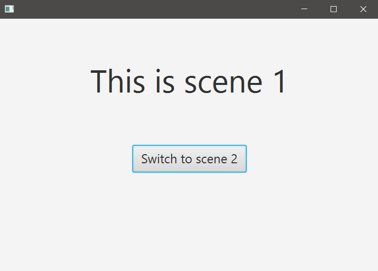
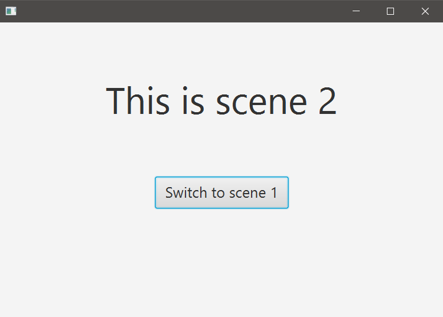

## Switching Scenes

Necesitaremos dos .fxml, uno para cada Scene, y un Controller.

### Creación de 2 archivos .fxml y el Controller

Nombres: scene1.fxml & scene2.fxml (borrar el que ya existe).
- New -> FXML File -> Name: scene1
- New -> FXML File -> Name: scene2  

Borrar el Controller que ya existe:
- New -> Java class -> Name: SceneController

### Archivo HelloApplication.java

Se indica 'scene1.fxml' porque es la que queremos que se muestre al ejecutar la aplicación.

~~~
public class HelloApplication extends Application {
    @Override
    public void start(Stage stage) throws IOException {
        try {
            Parent root = FXMLLoader.load(getClass().getResource("scene1.fxml"));
            Scene scene = new Scene(root);
            stage.setScene(scene);
            stage.show();
        } catch(Exception e) {
            e.printStackTrace();
        }
    }

    public static void main(String[] args) {
        launch();
    }
}
~~~

### Editando el Controlador

El cuerpo de los métodos es similar a la definición en la clase HelloApplication.java

~~~
public class SceneController {

    private Stage stage;
    private Scene scene;
    private Parent root;

    public void switchToScene1(ActionEvent event) throws IOException {
        root = FXMLLoader.load(getClass().getResource("scene1.fxml"));
        // get the source of the event and cast it to a Node
        stage = (Stage)((Node)event.getSource()).getScene().getWindow();
        scene = new Scene(root);
        stage.setScene(scene);
        stage.show();
    }
    public void switchToScene2(ActionEvent event) throws IOException {
        root = FXMLLoader.load(getClass().getResource("scene2.fxml"));
        stage = (Stage)((Node)event.getSource()).getScene().getWindow();
        scene = new Scene(root);
        stage.setScene(scene);
        stage.show();
    }
}
~~~

### Building Scenes

### Scene 1

- Container -> AnchorPane
- Controls
  - Label: Properties: 
    - Text: This is scene 1
    - Font: 50px
    - Center
  - Button: Properties:
      - Text: Switch to scene 2
      - Font: 20px
      - Center

**Vincular con el controllador**
- Panel izquierdo: Controller
  - Controller class: com.sunday.switchscenes.SceneController

**Asignar evento al botón**
- Click en el botón -> panel derecho: Code -> onAction: switchToScene2

**File -> Save**

### Scene 2

- File -> Open: scene2.fxml

- Container -> AnchorPane
- Controls
    - Label: Properties:
        - Text: This is scene 2
        - Font: 50px
        - Center
    - Button: Properties:
        - Text: Switch to scene 1
        - Font: 20px
        - Center

**Vincular con el controllador**
- Panel izquierdo: Controller
    - Controller class: com.sunday.switchscenes.SceneController

**Asignar evento al botón**
- Click en el botón -> panel derecho: Code -> onAction: switchToScene1

**File -> Save**

**Abrir los archivos .fxml para asegurarnos que los cambios se hayan guardado, y ejecutar.**

